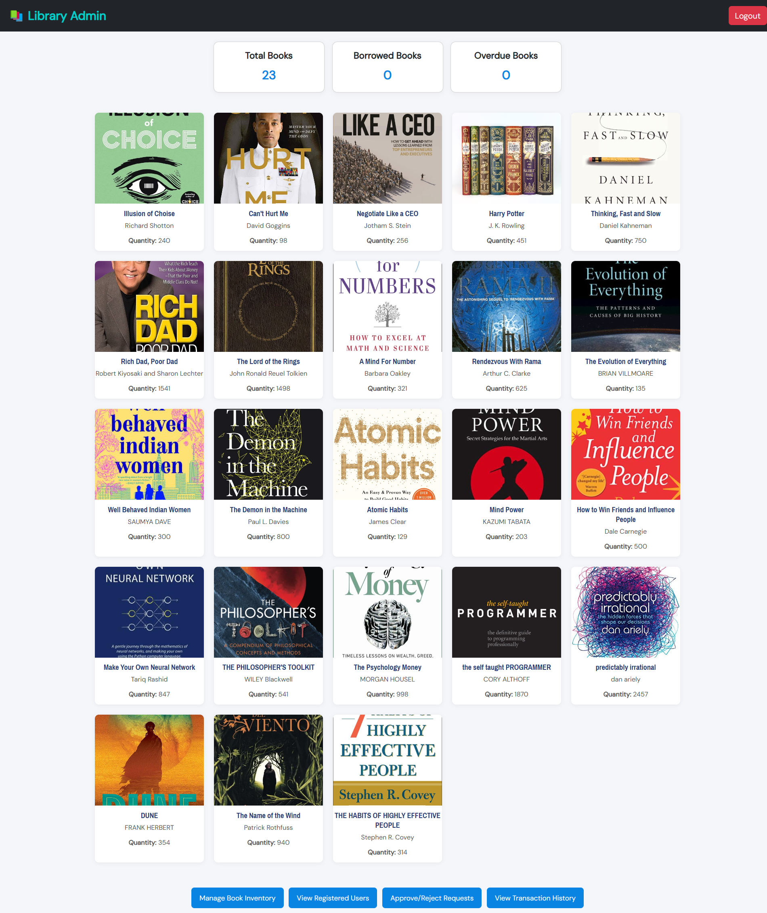
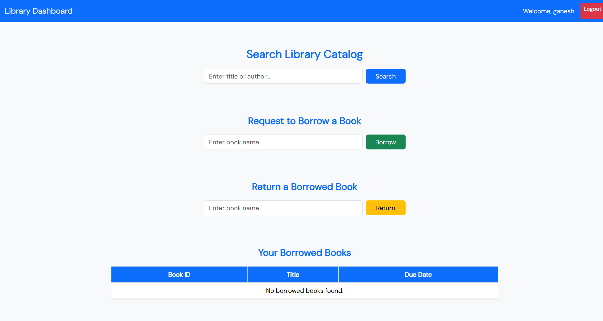
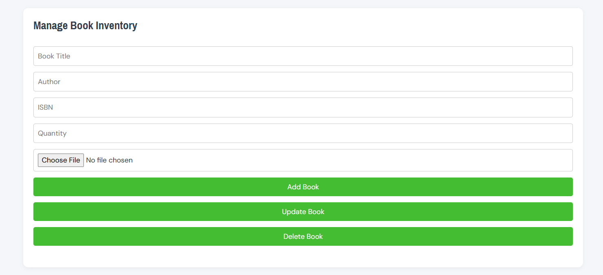
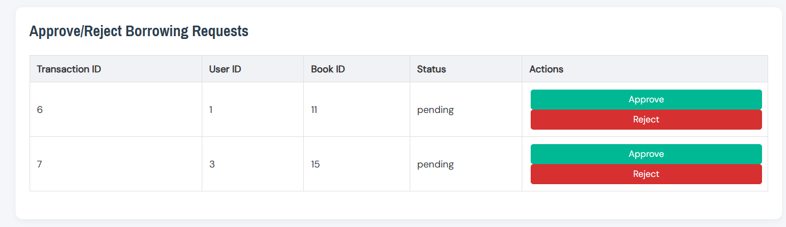

# 📚 Library Management System

A full-stack web application for managing library operations such as **book inventory, user accounts, and transaction records**. Built using Java Servlets, JDBC, and MySQL with a responsive frontend in HTML, CSS, Bootstrap and JavaScript.

---

## 📘 Project Overview

**Technologies Used**: Java · Servlets · JDBC · MySQL · HTML · CSS · Bootstrap · JavaScript · Apache Tomcat

- 🧩 Developed a **full-stack Library Management System** to manage books, users, and borrow/return transactions.  
- 🔐 Implemented **role-based login** for Admins and Users with **secure session management**.  
- 🛠️ Enabled **CRUD operations** for books, users, and borrow/return records using **Java Servlets and JDBC**.  
- 📝 Admins can **add, edit, delete books**, **manage users**, **approve borrow requests**, and **view transaction history**.  
- 🎨 Designed a **responsive and interactive UI** using HTML, CSS, Bootstrap, and JavaScript for enhanced user experience.  
- 🔒 Used **prepared statements** for secure database operations.  
- 🚀 Deployed and tested the application on **Apache Tomcat**.

---

## 🚀 Features

- 👨‍🏫 **Admin Login & Dashboard**  
- 👨‍🎓 **User Login & Signup**  
- 📚 Add/Edit/Delete Books (Admin)  
- 👤 View and Manage Users (Admin)  
- ✅ Approve/Reject Borrow Requests (Admin)  
- 📄 View Transaction History (Admin)  
- 🔐 Session-Based Access Control  
- 📱 Responsive Web Interface  

---

## 🖼️ Screenshots

| Feature | Screenshot |
|---------|------------|
| 🔐 Signup |  |
| 🔐 Login |  |
| 🏠 Admin Dashboard |  |
| 🏠 User Dashboard |  |
| 📚 Book Management |  |
| 👤 Borrowing Requests |  |


---

## 🛠️ Tech Stack

- **Frontend**: HTML, CSS, Bootstrap, JavaScript  
- **Backend**: Java Servlets  
- **Database**: MySQL  
- **Database Access**: JDBC with prepared statements  
- **Server**: Apache Tomcat  
- **IDE**: Eclipse

---

## ⚙️ How to Run Locally

1. **Clone the Repository**
   ```bash
   git clone https://github.com/lukeshsable/Library_Management_System_Project.git
   cd Library_Management_System_Project
